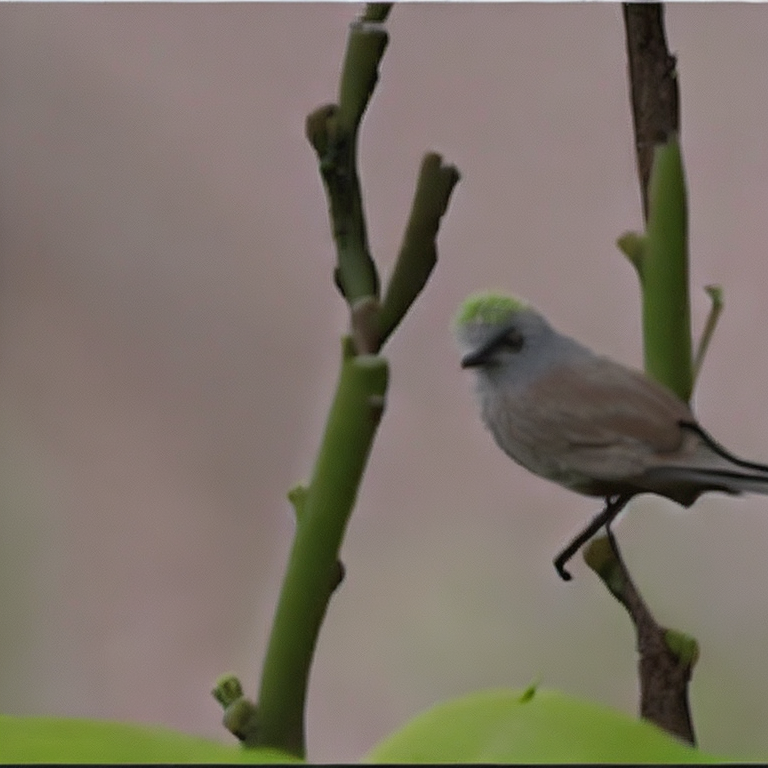
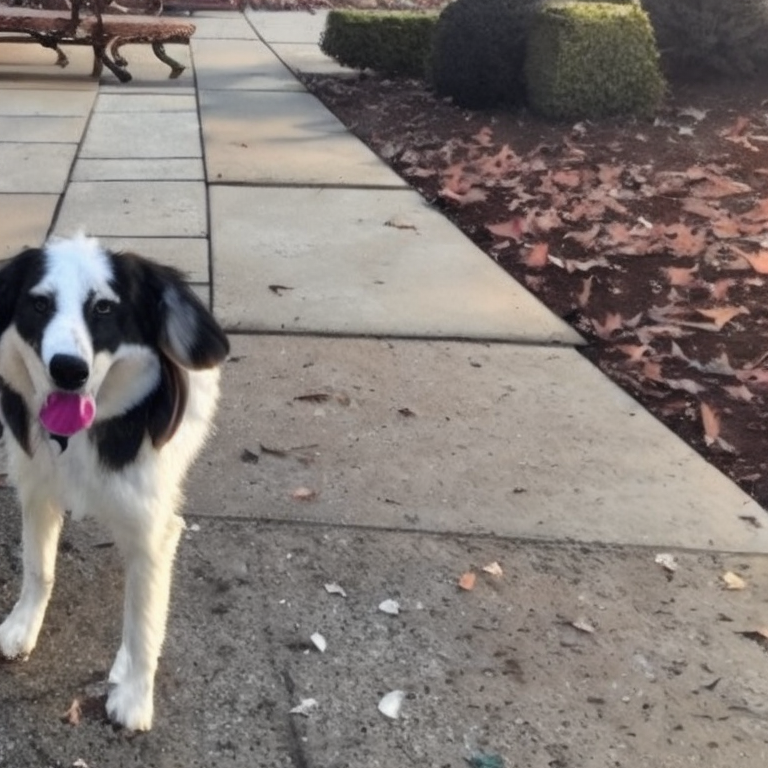

# Anything To Image

Generate image from anything with [ImageBind](https://github.com/facebookresearch/ImageBind)'s unified latent space and [stable-diffusion-2-1-unclip](https://huggingface.co/stabilityai/stable-diffusion-2-1-unclip). 

- No training is need.
- Integration with 🤗  [Diffusers](https://github.com/huggingface/diffusers).
- `imagebind` is directly copy from [official repo](https://github.com/facebookresearch/ImageBind) with modification. 

## Audio to Image

| `assets/bird_audio.wav` | `assets/dog_audio.wav` | 
| --- | --- |
|  |  |

```python
import imagebind
import torch
from diffusers import StableUnCLIPImg2ImgPipeline

# construct models
device = "cuda:0" if torch.cuda.is_available() else "cpu"
pipe = StableUnCLIPImg2ImgPipeline.from_pretrained(
    "stabilityai/stable-diffusion-2-1-unclip", torch_dtype=torch.float16, variation="fp16"
)
pipe = pipe.to(device)

model = imagebind.imagebind_huge(pretrained=True)
model.eval()
model.to(device)

# generate image
with torch.no_grad():
    audio_paths=["assets/bird_audio.wav"]
    embeddings = model.forward({
        imagebind.ModalityType.AUDIO: imagebind.load_and_transform_audio_data(audio_paths, device),
    })
    embeddings = embeddings[imagebind.ModalityType.AUDIO]
    images = pipe(image_embeds=embeddings.half()).images
    images[0].save("bird_audio.png")
```

## More 

Under construction


## Citation

Latent Diffusion

```bibtex
@InProceedings{Rombach_2022_CVPR,
    author    = {Rombach, Robin and Blattmann, Andreas and Lorenz, Dominik and Esser, Patrick and Ommer, Bj\"orn},
    title     = {High-Resolution Image Synthesis With Latent Diffusion Models},
    booktitle = {Proceedings of the IEEE/CVF Conference on Computer Vision and Pattern Recognition (CVPR)},
    month     = {June},
    year      = {2022},
    pages     = {10684-10695}
}
```

ImageBind
```bibtex
@inproceedings{girdhar2023imagebind,
  title={ImageBind: One Embedding Space To Bind Them All},
  author={Girdhar, Rohit and El-Nouby, Alaaeldin and Liu, Zhuang
and Singh, Mannat and Alwala, Kalyan Vasudev and Joulin, Armand and Misra, Ishan},
  booktitle={CVPR},
  year={2023}
}
```