# Anything To Image
<a href='https://huggingface.co/spaces/aaronb/Anything2Image'></a>
[](https://pypi.org/project/anything2image/) 

Generate image from anything with [ImageBind](https://github.com/facebookresearch/ImageBind)'s unified latent space and [stable-diffusion-2-1-unclip](https://huggingface.co/stabilityai/stable-diffusion-2-1-unclip). 

- No training is need.
- Integration with 🤗  [Diffusers](https://github.com/huggingface/diffusers).
- Online gradio demo with [Huggingface Space](https://huggingface.co/spaces/aaronb/Anything2Image).

**Support Tasks**

- [Audio to Image](#audio-to-image)
- [Audio+Text to Image](#audiotext-to-image)
- [Audio+Image to Image](#audioimage-to-image)
- [Image to Image](#image-to-image)
- [Text to Image](#text-to-image)

**Requirements**

- Python >= 3.8
- PyTorch >= 1.13

**Usage**

```bash
pip install anything2image
# lanuch gradio demo
python -m anything2image.app
```

## Audio to Image

| [bird_audio.wav](assets/wav/bird_audio.wav) | [dog_audio.wav](assets/wav/dog_audio.wav) |  [cattle.wav](assets/wav/cattle.wav) | [cat.wav](assets/wav/cat.wav) | 
| --- | --- | --- | --- | 
|  |  | | |

| [fire_engine.wav](assets/wav/fire_engine.wav) | [train.wav](assets/wav/train.wav) |  [motorcycle.wav](assets/wav/motorcycle.wav) | [plane.wav](assets/wav/plane.wav) | 
| --- | --- | --- | --- | 
| 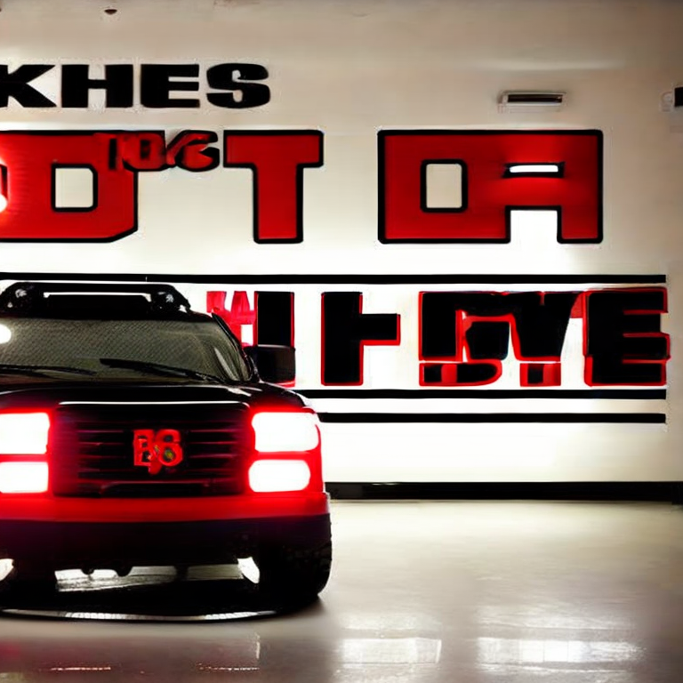 | 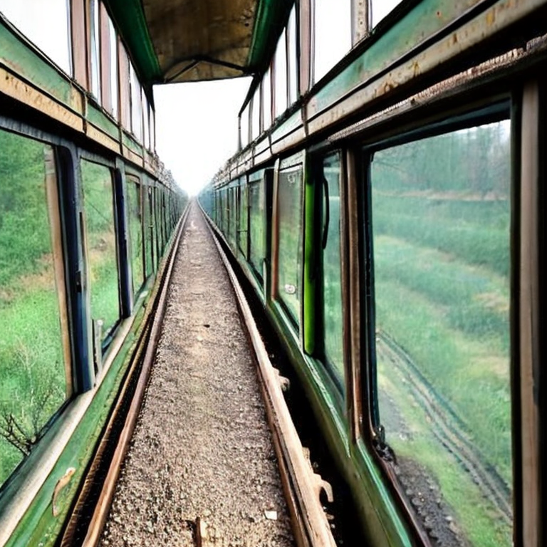 |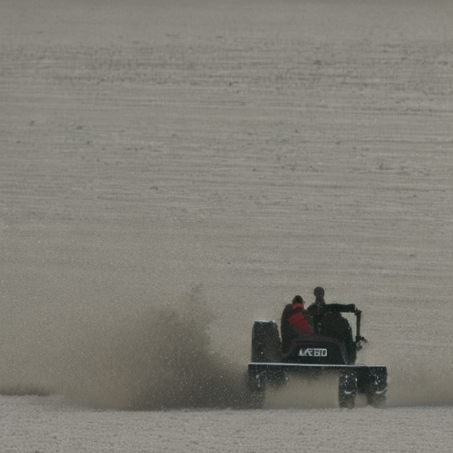 |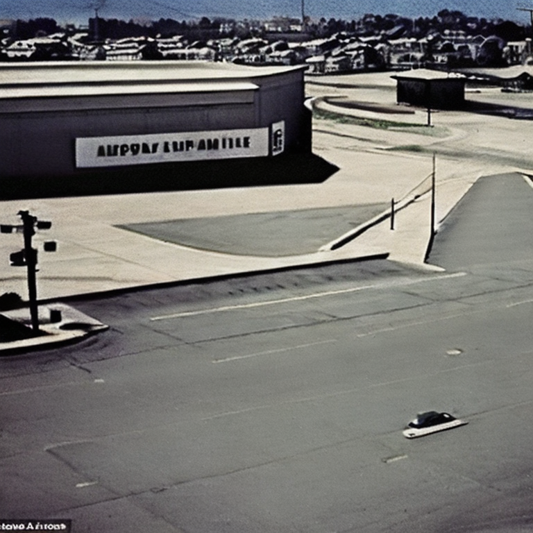 |


```bash
python -m anything2image.cli --audio assets/wav/cat.wav
```

See also [audio2img.py](tasks/audio2img.py).

```python
import anything2image.imagebind as ib
import torch
from diffusers import StableUnCLIPImg2ImgPipeline

# construct models
device = "cuda:0" if torch.cuda.is_available() else "cpu"
pipe = StableUnCLIPImg2ImgPipeline.from_pretrained(
    "stabilityai/stable-diffusion-2-1-unclip", torch_dtype=torch.float16
).to(device)
model = ib.imagebind_huge(pretrained=True).eval().to(device)

# generate image
with torch.no_grad():
    audio_paths=["assets/wav/bird_audio.wav"]
    embeddings = model.forward({
        ib.ModalityType.AUDIO: ib.load_and_transform_audio_data(audio_paths, device),
    })
    embeddings = embeddings[ib.ModalityType.AUDIO]
    images = pipe(image_embeds=embeddings.half()).images
    images[0].save("audio2img.png")
```

## Audio+Text to Image 


| [cat.wav](assets/wav/cat.wav) | [cat.wav](assets/wav/cat.wav) |  [bird_audio.wav](assets/wav/bird_audio.wav) | [bird_audio.wav](assets/wav/bird_audio.wav) | 
| --- | --- | --- | --- | 
| A painting    | A photo    |  A painting   |  A photo   | 
| 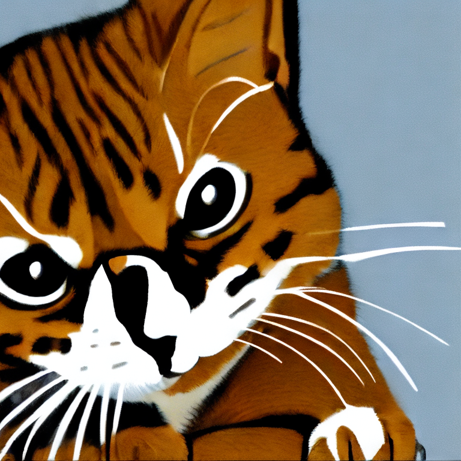 | 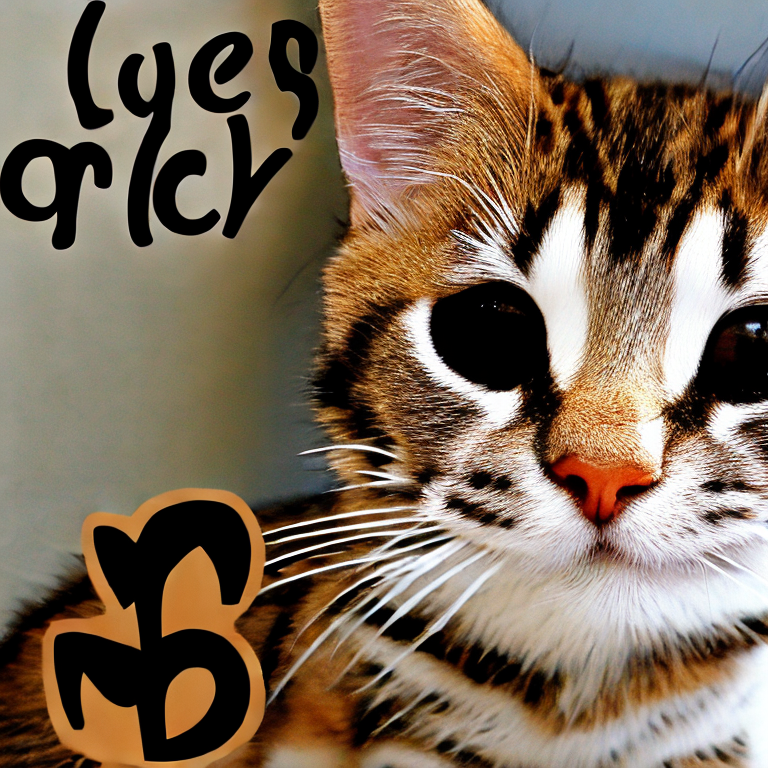 |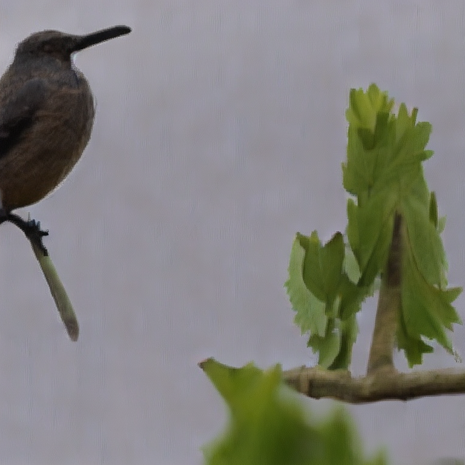 |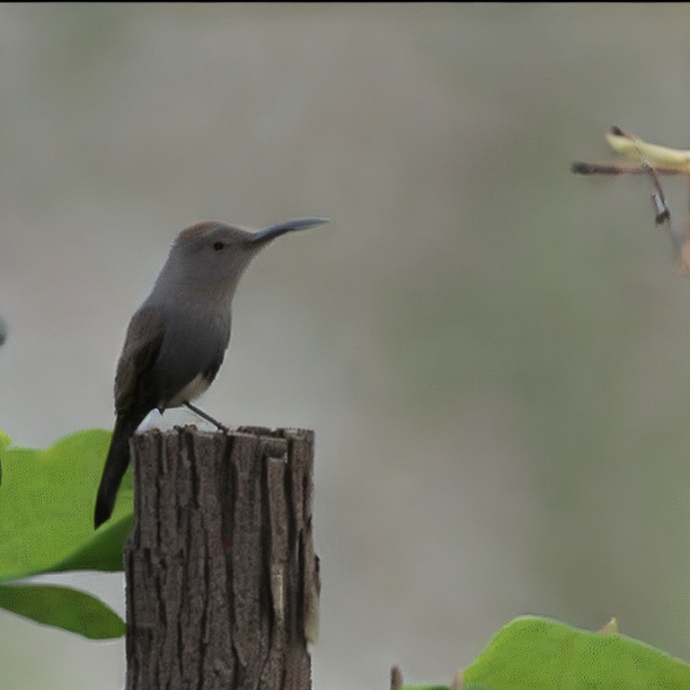 |

```bash
python -m anything2image.cli --audio assets/wav/cat.wav --prompt "a painting"
```

See also [audiotext2img.py](tasks/audiotext2img.py).

```python
with torch.no_grad():
    audio_paths=["assets/wav/bird_audio.wav"]
    embeddings = model.forward({
        ib.ModalityType.AUDIO: ib.load_and_transform_audio_data(audio_paths, device),
    })
    embeddings = embeddings[ib.ModalityType.AUDIO]
    images = pipe(prompt='a painting', image_embeds=embeddings.half()).images
    images[0].save("audiotext2img.png")
```

## Audio+Image to Image

Stay tuned

| Image | Audio 1 | Output 1 |  Audio 2  | Output 2 | 
| --- | --- | --- | --- | --- | 
|  | [wave.wav](assets/wav/wave.wav) | 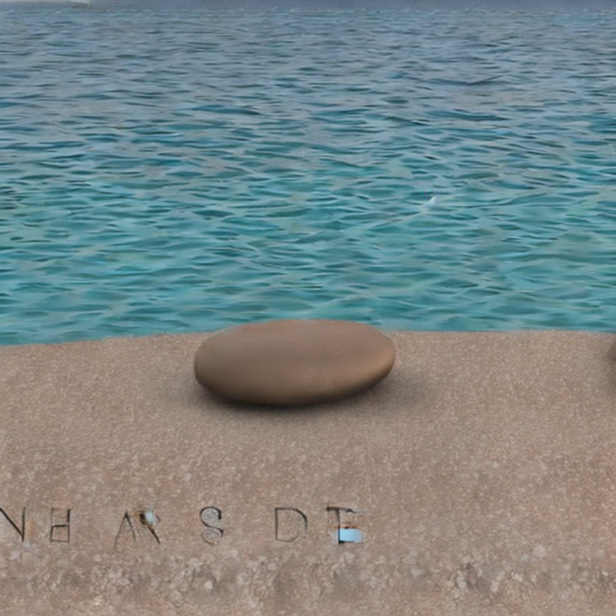 |  [rain.wav](assets/wav/wave.wav) | 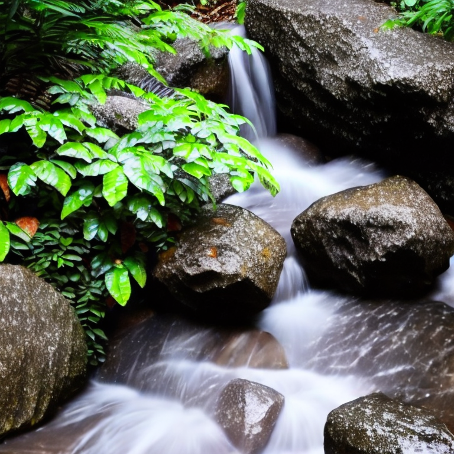 | 

```bash
python -m anything2image.cli --audio assets/wav/wave.wav --image "assets/image/bird.png"
```

```python
with torch.no_grad():
    embeddings = model.forward({
        ib.ModalityType.VISION: ib.load_and_transform_vision_data(["assets/image/bird.png"], device),
    })
    img_embeddings = embeddings[ib.ModalityType.VISION]
    embeddings = model.forward({
        ib.ModalityType.AUDIO: ib.load_and_transform_audio_data(["assets/wav/wave.wav"], device),
    }, normalize=False)
    audio_embeddings = embeddings[ib.ModalityType.AUDIO]
    embeddings = (img_embeddings + audio_embeddings)/2
    images = pipe(image_embeds=embeddings.half()).images
    images[0].save("audioimg2img.png")
```


## Image to Image

|  |  |   |  | 
| --- | --- | --- | --- | 
| 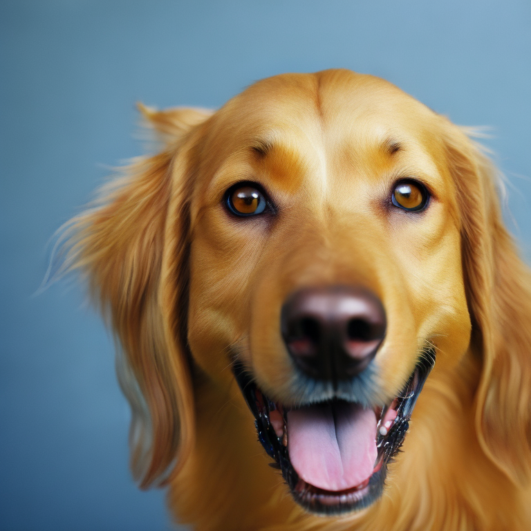 |  | |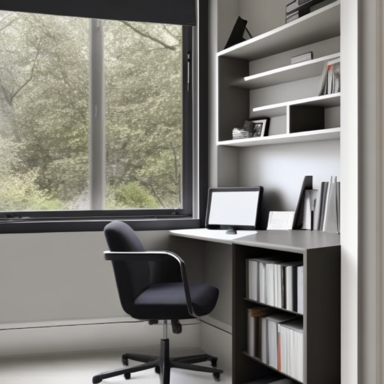 |

Top: Input Images. Bottom: Generated Images. 

```bash
python -m anything2image.cli --image "assets/image/bird.png"
```

See also [img2img.py](tasks/img2img.py). 

```python
with torch.no_grad():
    paths=["assets/image/room.png"]
    embeddings = model.forward({
        ib.ModalityType.VISION: ib.load_and_transform_vision_data(paths, device),
    }, normalize=False)
    embeddings = embeddings[ib.ModalityType.VISION]
    images = pipe(image_embeds=embeddings.half()).images
    images[0].save("img2img.png")
```

## Text to Image

| A photo of a car. | A sunset over the ocean. | A bird's-eye view of a cityscape.  | A close-up of a flower. | 
| --- | --- | --- | --- | 
| 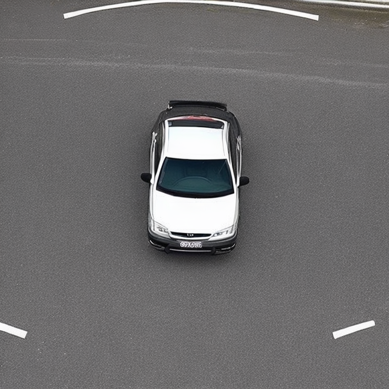 | 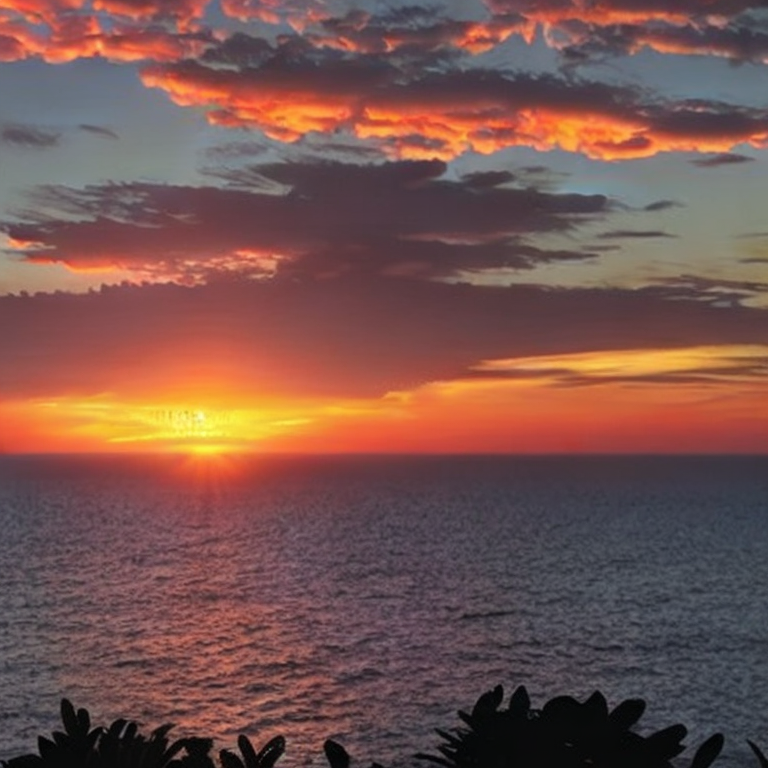 |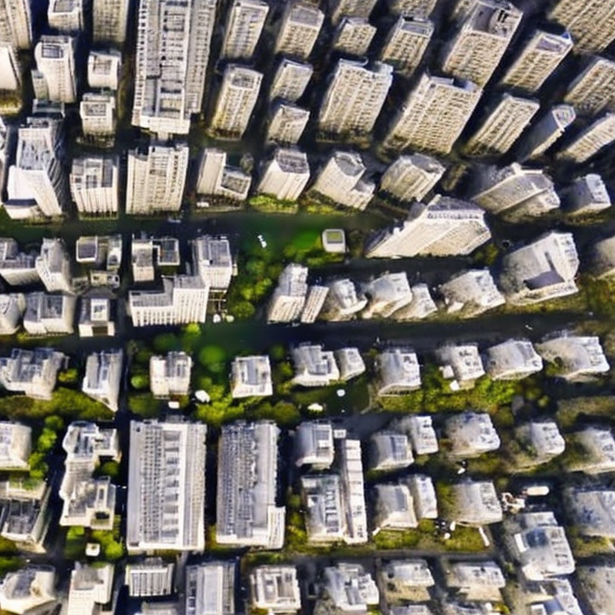 |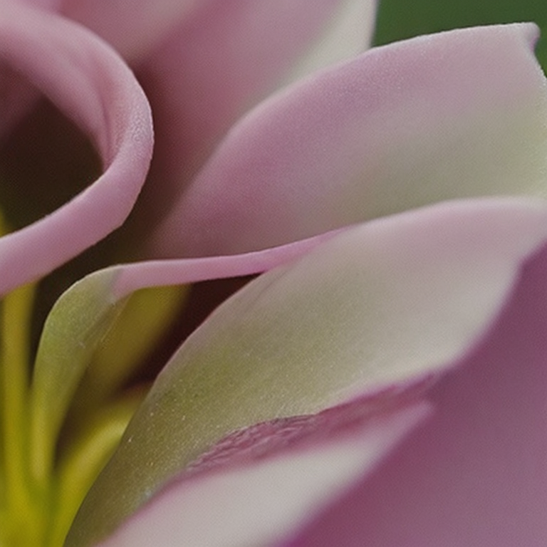 |

It is not necessary to use ImageBind for text to image. Nervertheless, we show the alignment of ImageBind's text latent space and its image spaces.

```bash
python -m anything2image.cli --text "A sunset over the ocean."
```

See also [text2img.py](tasks/text2img.py). 

```python
with torch.no_grad():
    embeddings = model.forward({
        ib.ModalityType.TEXT: ib.load_and_transform_text(['A photo of a car.'], device),
    }, normalize=False)
    embeddings = embeddings[ib.ModalityType.TEXT]
    images = pipe(image_embeds=embeddings.half()).images
    images[0].save("text2img.png")
```

<!-- ## Discussion

Failure cases

| Audio to Image | Audio to Image | Image to Image | 
| --- | --- | --- | 
| [car_audio.wav](assets/wav/car_audio.wav) | [goat.wav](assets/wav/goat.wav) |  | 
|  | 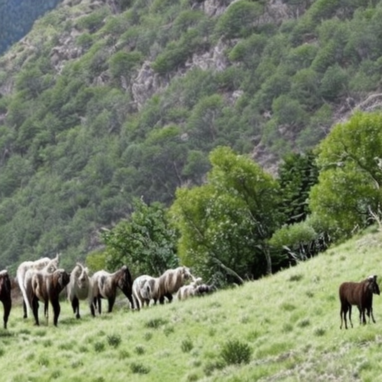  |  |  -->


## Citation

Latent Diffusion

```bibtex
@InProceedings{Rombach_2022_CVPR,
    author    = {Rombach, Robin and Blattmann, Andreas and Lorenz, Dominik and Esser, Patrick and Ommer, Bj\"orn},
    title     = {High-Resolution Image Synthesis With Latent Diffusion Models},
    booktitle = {Proceedings of the IEEE/CVF Conference on Computer Vision and Pattern Recognition (CVPR)},
    month     = {June},
    year      = {2022},
    pages     = {10684-10695}
}
```

ImageBind
```bibtex
@inproceedings{girdhar2023imagebind,
  title={ImageBind: One Embedding Space To Bind Them All},
  author={Girdhar, Rohit and El-Nouby, Alaaeldin and Liu, Zhuang
and Singh, Mannat and Alwala, Kalyan Vasudev and Joulin, Armand and Misra, Ishan},
  booktitle={CVPR},
  year={2023}
}
```
